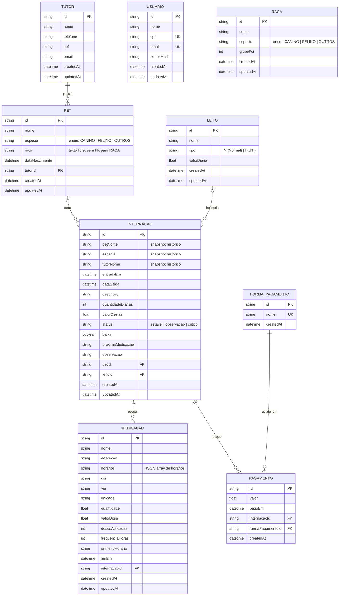

# Diagrama Entidade-Relacionamento (Mermaid)

Modelo gerado a partir de [`backend/prisma/schema.prisma`](../backend/prisma/schema.prisma). Renderiza nativamente no GitHub e em qualquer visualizador com suporte a Mermaid.

## Notas de modelagem

- **`RACA` é um catálogo independente:** `Pet.raca` é um campo de texto livre, não uma chave estrangeira para `RACA`. A tabela serve apenas para consulta/autocomplete de raças caninas e felinas.
- **`USUARIO` não se relaciona com outras entidades:** usado exclusivamente para autenticação (login) e não referencia nem é referenciado por internações, pets ou tutores.
- **`INTERNACAO` guarda snapshots históricos** (`petNome`, `especie`, `tutorNome`) além das FKs para `PET` e `LEITO`, que são opcionais (`petId`/`leitoId` anuláveis) — preserva o histórico da internação mesmo que o pet ou o leito seja removido depois.
- **Exclusão em cascata:** `MEDICACAO` e `PAGAMENTO` são removidos automaticamente se a `INTERNACAO` associada for excluída (`onDelete: Cascade` no schema).
